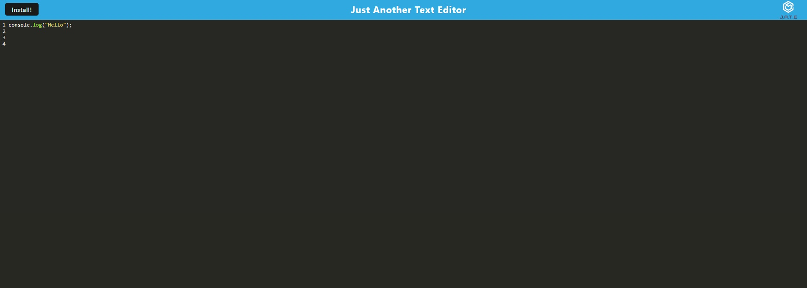

# JATE

---

## Description

>This project is a browser-based text editor designed to function as a Progressive Web Application (PWA). It allows developers to create and manage notes or code snippets, with or without an internet connection. The application uses various data persistence techniques to ensure reliability and accessibility of data across different browsers and conditions. It's built to function offline, leveraging technologies like service workers, IndexedDB, and modern JavaScript.

---

## Table of Contents

- [JATE](#jate)
  - [Description](#description)
  - [Table of Contents](#table-of-contents)
  - [Installation](#installation)
  - [Usage](#usage)
  - [Demo](#demo)
  - [Credits](#credits)
  - [License](#license)
  - [Features](#features)
  - [Contributing](#contributing)
  - [Tests](#tests)
  - [Questions](#questions)

---

## Installation

>To install this application:

1. Clone the repository to your local machine.
2. Navigate to the root directory of the application in your terminal.
3. Run npm install to install all necessary dependencies.
4. Execute npm run start to start both the backend server and serve the client.

---

## Usage

>After installation:

- Run npm run dev from the root directory to launch the application.
- The application will bundle JavaScript files using webpack.
- Webpack plugins generate an HTML file, service worker, and a manifest file.
- The text editor supports next-gen JavaScript and functions without errors in the browser.
- IndexedDB creates a database storage upon opening the text editor.
- Content entered is saved with IndexedDB when clicking off the DOM window.
- Reopening the text editor retrieves content from IndexedDB.
- Click the 'Install' button to download and install the web application as a desktop icon.
- The application has a registered service worker using workbox for offline functionality.
- Static assets and pages are pre-cached for efficient loading.

---

## Demo

[Link to deployed application](https://jate-b00o.onrender.com)

---

## Credits

>This project uses the following technologies:

- Node.js
- Express.js
- Webpack
- Workbox
- Babel
- ESLint
- Concurrently
- render

---

## License

This project is licensed under the [MIT License](LICENSE).

---

## Features

- Single-page application meeting PWA criteria.
- Offline functionality with service workers.
- Data persistence using IndexedDB.
- Bundling with webpack.
- Next-gen JavaScript compatibility.
- Desktop installation capability.

---

## Contributing

>Contributions to this project are welcome. Please follow these steps to contribute:

1. Fork the repository.
2. Create a new branch for your feature.
3. Commit your changes with clear, descriptive messages.
4. Push the branch to your fork.
5. Submit a pull request.

---

## Tests

N/A

---

## Questions

Please visit my GitHub profile:

[GitHub](https://github.com/EhsanAsh)

If you have any questions regarding this Application, please email me at:

[Email Me](ehsan.ashrafipour@gmail.com)